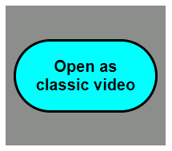
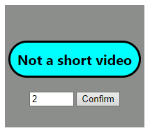

## No Shorts Please

**<i><u>If not on YouTube : </u></i>**

Just a YouTube logo which opens YouTube on a new tab.

**<i><u>If on YouTube and on a short video :</u></i>**

Allow user to click on a button that opens on a new tab the video as a "normal" video and will close the short video tab.

**<i><u>If on YouTube on a "classic" video :</u></i>**

Displays a button that says the user isn't on a short video, and allows the user to choose a reading speed.
